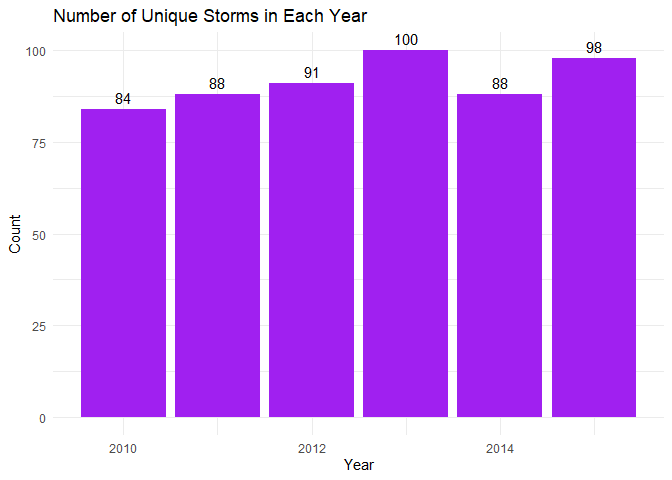

Workout 1 Report
================
Elias Junior Ghantous
October 18, 2019


### What is the number of (unique) storms in each year?

``` r
storms_per_year <- count(distinct(dat, season, name), season)
ggplot(data = storms_per_year, aes(x = season, y = n)) + geom_bar(stat = 'identity', fill = "purple") + geom_text(aes(label = n), vjust=-0.5) +
  xlab("Year") + ylab("Count") + ggtitle("Number of Unique Storms in Each Year") + theme_minimal()
```

 Overall, the total number of unique storms per year has remained very similar but there does seem to be a slow gradual uptick in storm occurence as the years go by. Could this be because of global warming? This might be something to look into.

### What is the total number of storms per hemisphere? Do storms tend to occur more often in one hemisphere than in the other?

``` r
#northern hemisphere
northhem = count(filter(dat, latitude >= 0), serial_num)
nrow(northhem)
```

    ## [1] 400

``` r
#southern hemisphere
southhem = count(filter(dat, latitude <= 0), serial_num)
nrow(southhem)
```

    ## [1] 142

The total number of storms in the Northern Hemisphere and Southern Hemisphere are 400 and 142, respectively. This is a major difference which suggests that the climate in the Northern Hemisphere is more encouraging for storm formation than that of the Southern Hemisphere. However, most of the storms actually occur around the equator which is pretty common throughout the data for all years, indicating that the equator provides conditions suitable for storm formation.

### Do storms tend to occur uniformly throughout the year (evenly amount of storms per month)? Or are there months where there's more storm activity?

``` r
dat <- mutate(dat, month_str = month(iso_time, label = TRUE))
storms_per_month <- count(distinct(dat, month_str, name), month_str)
ggplot(data = storms_per_month, aes(x = month_str, y = n)) + geom_bar(stat = 'identity', fill = "purple") + geom_text(aes(label = n), vjust=-0.5) +
  xlab("Month") + ylab("Count") + ggtitle("Number of Unique Storms in Each Month") + theme_minimal()
```

 Storms, according to the graph, have seasonal cycles throughout the year with two main periods of occurence. The most active period is July-October and the second most active period is December-February. The month with the most storms is September and that coincides with monsoon season in areas like Southeast Asia.  Above is a map of the trajectories of Eastern Pacific and North Atlantic basin storms.

### Is there a particular Basin where storms occur more frequently? Or are there Basins without much storm activity?

``` r
storms_per_basin <- count(distinct(dat, basin, name), basin)
ggplot(data = storms_per_basin, aes(x = basin, y = n)) + geom_bar(stat = 'identity', fill = "purple") + geom_text(aes(label = n), vjust=-0.5) +
  xlab("Basin") + ylab("Count") + ggtitle("Number of Unique Storms By Basin") + theme_minimal()
```

 The Western Pacific and Eastern Pacific basins are the most active basins by far with the South Atlantic basin having only one recorded storm. The Pacific ocean seems to be the most conducive to storm formation over the period of time from 2010-2015. It could be worth it to take a look at the data for wind speeds over the Pacific and the torrent vectors formed around the ocean surface. 

### What is the typical duration of a storm (e.g. in terms of hours, or days)? Are there storms with durations that deviate considerably from the typical duration?

``` r
stormdurations <- count(distinct(dat, serial_num, iso_time), serial_num)
stormdurations <- mutate(stormdurations, duration_days = (n-1)/4)
summary(stormdurations$duration_days)
```

    ##    Min. 1st Qu.  Median    Mean 3rd Qu.    Max. 
    ##   0.500   5.000   7.750   8.398  11.000  27.000

``` r
sd(stormdurations$duration_days)
```

    ## [1] 4.742291

From the data, storms have averaged a duration of 8.398 days. Of particular note is the standard deviation of 4.742291 days. This means that, because the 3rd quartile is 11.0, there are about 15% of storms that last more than one standard devaition above the mean.

### What is the top-10 list of storms in terms of high wind speed values?

``` r
max_wind_per_storm <- as_tibble(summarize(group_by(dat, name, season), max_wind = max(wind)))
max_wind_per_storm <- arrange(max_wind_per_storm, desc(max_wind))
slice(max_wind_per_storm, 1:10)
```

    ## # A tibble: 10 x 3
    ##    name     season max_wind
    ##    <chr>     <int>    <dbl>
    ##  1 PATRICIA   2015      185
    ##  2 CELIA      2010      140
    ##  3 MARIE      2014      140
    ##  4 AMANDA     2014      135
    ##  5 DORA       2011      135
    ##  6 IGOR       2010      135
    ##  7 JIMENA     2015      135
    ##  8 JOAQUIN    2015      135
    ##  9 CRISTINA   2014      130
    ## 10 OLAF       2015      130

The table above shows that the highest wind speed recorded was achieved by PATRICIA in 2015. An interesting takeaway from this table is that most of the faster storms occured more recently in 2014 and 2015.

### Conclusion

Storms have become more frequent than ever before. They have also become arguably more dangerous, reaching higher wind speeds as the years progress. Could this be a trend that is going to continue? If because of global warming, then the trend will remain and the storms will only get more powerful which doesn't bode well for the future. However, the data does have a few silver linings like the ability to identify the months where stroms are more frequent, giving us a better sense on how hard to prepare in case the storms do impact the land they crash onto.
